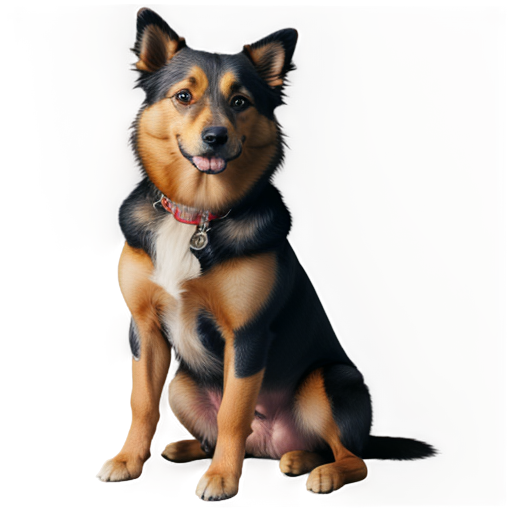
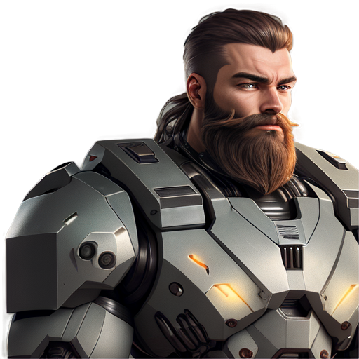
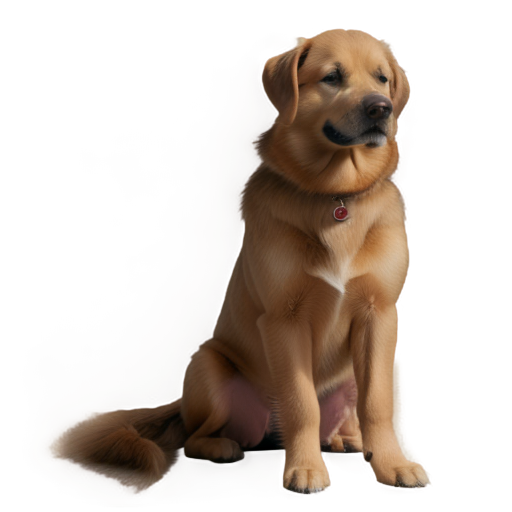
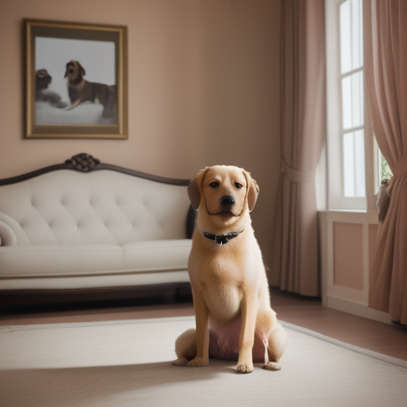
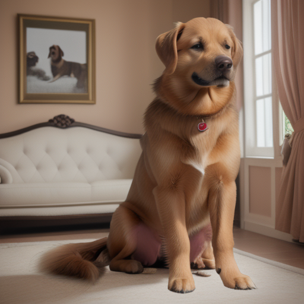
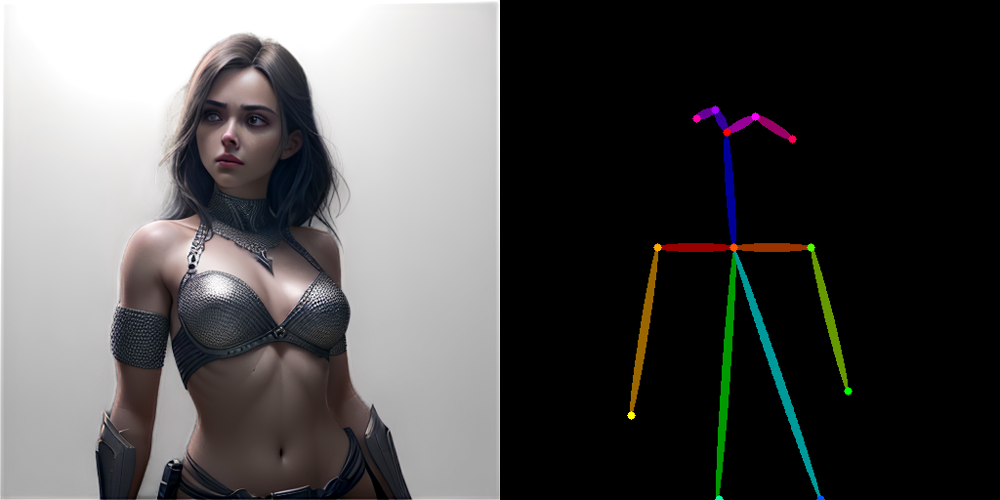
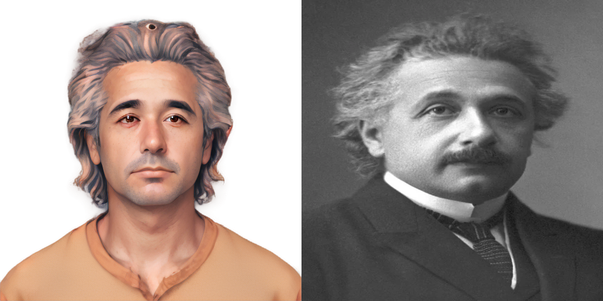
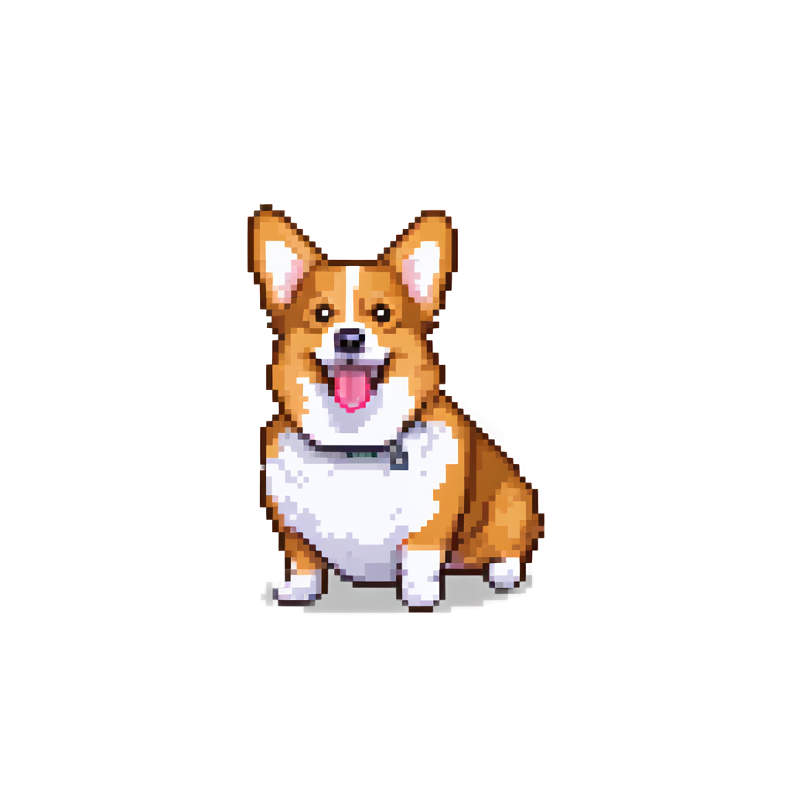
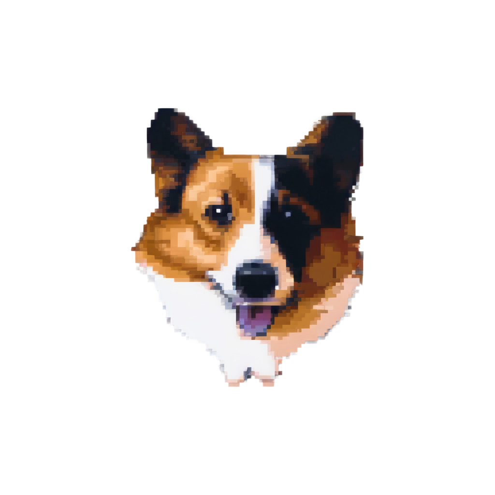

# Diffusers API of Transparent Image Layer Diffusion using Latent Transparency
Create transparent image with Diffusers!

This is a port to Diffuser from original [SD Webui's Layer Diffusion](https://github.com/layerdiffusion/sd-forge-layerdiffuse) to extend the ability to generate transparent image with your favorite API


Paper: [Transparent Image Layer Diffusion using Latent Transparency](https://arxiv.org/abs/2402.17113)
## Setup
```bash
pip install -r requirements.txt
```

## Quickstart

Generate transparent image with SD1.5 models. In this example, we will use [digiplay/Juggernaut_final](https://huggingface.co/digiplay/Juggernaut_final) as the base model

```python
from huggingface_hub import hf_hub_download
from safetensors.torch import load_file
import torch

from diffusers import StableDiffusionPipeline

from models import TransparentVAEDecoder
from loaders import load_lora_to_unet


if __name__ == "__main__":

    model_path = hf_hub_download(
        'LayerDiffusion/layerdiffusion-v1',
        'layer_sd15_vae_transparent_decoder.safetensors',
    )

    vae_transparent_decoder = TransparentVAEDecoder.from_pretrained("digiplay/Juggernaut_final", subfolder="vae", torch_dtype=torch.float16).to("cuda")
    vae_transparent_decoder.set_transparent_decoder(load_file(model_path))

    pipeline = StableDiffusionPipeline.from_pretrained("digiplay/Juggernaut_final", vae=vae_transparent_decoder, torch_dtype=torch.float16, safety_checker=None).to("cuda")

    model_path = hf_hub_download(
        'LayerDiffusion/layerdiffusion-v1',
        'layer_sd15_transparent_attn.safetensors'
    )

    load_lora_to_unet(pipeline.unet, model_path, frames=1)
    
    image = pipeline(prompt="a dog sitting in room, high quality", 
                       width=512, height=512,
                       num_images_per_prompt=1, return_dict=False)[0]
```

Would produce the below image


## Scripts

- `test_diffusers_fg_only.py`: Only generate transparent foreground image
- `test_diffusers_joint.py`: Generate foreground, background, blend image together. Hence `num_images_per_prompt` must be batch size of 3
- `test_diffusers_fg_only_sdxl.py`: Only generate transparent foreground image using Attention injection in SDXL
- `test_diffusers_fg_only_conv_sdxl.py`: Only generate transparent foreground image using Conv injection in SDXL

It is said by the author that Attention injection would result in better generation quality and Conv injection would result in better prompt alignment

## Example
### Stable Diffusion 1.5
#### Generate only transparent image with SD1.5

#### Generate foreground and background together
Foreground


Background


Blended



#### Use with ControlNet



#### Use with IP-Adapter



### Stable Diffusion XL
#### Generate with SDXL (Attn)
Combine with SDXL Lora [nerijs/pixel-art-xl](https://huggingface.co/nerijs/pixel-art-xl)


#### Generate with SDXL (Conv)
Combine with SDXL Lora [nerijs/pixel-art-xl](https://huggingface.co/nerijs/pixel-art-xl)


## Acknowledgments
This work is based on the great code at
[https://github.com/layerdiffusion/sd-forge-layerdiffuse](https://github.com/layerdiffusion/sd-forge-layerdiffuse)
