# Diffusers API of Transparent Image Layer Diffusion using Latent Transparency

🤗 **Hugging Face**: [](https://huggingface.co/rootonchair/diffuser_layerdiffuse) 🔥🔥🔥

Create transparent image with Diffusers!

This is a port to Diffuser from original [SD Webui's Layer Diffusion](https://github.com/layerdiffusion/sd-forge-layerdiffuse) to extend the ability to generate transparent image with your favorite API


Paper: [Transparent Image Layer Diffusion using Latent Transparency](https://arxiv.org/abs/2402.17113)
## Setup
```bash
pip install -r requirements.txt
```

## Tests
```bash
python -m pytest
```

Optional GPU/model-download smoke tests are skipped by default. Run them explicitly with:
```bash
LAYERDIFFUSE_RUN_GPU_SMOKE=1 python -m pytest -m gpu
```

## Quickstart

Generate transparent image with SD1.5 models. In this example, we will use [digiplay/Juggernaut_final](https://huggingface.co/digiplay/Juggernaut_final) as the base model

### Stable Diffusion 1.5

```python
from huggingface_hub import hf_hub_download
from safetensors.torch import load_file
import torch

from diffusers import StableDiffusionPipeline

from models import TransparentVAEDecoder
from loaders import load_lora_to_unet


model_path = hf_hub_download(
    'LayerDiffusion/layerdiffusion-v1',
    'layer_sd15_vae_transparent_decoder.safetensors',
)

vae_transparent_decoder = TransparentVAEDecoder.from_pretrained("digiplay/Juggernaut_final", subfolder="vae", torch_dtype=torch.float16).to("cuda")
vae_transparent_decoder.set_transparent_decoder(load_file(model_path))

pipeline = StableDiffusionPipeline.from_pretrained("digiplay/Juggernaut_final", vae=vae_transparent_decoder, torch_dtype=torch.float16, safety_checker=None).to("cuda")

model_path = hf_hub_download(
    'LayerDiffusion/layerdiffusion-v1',
    'layer_sd15_transparent_attn.safetensors'
)

load_lora_to_unet(pipeline.unet, model_path, frames=1)

image = pipeline(prompt="a dog sitting in room, high quality", 
                    width=512, height=512,
                    num_images_per_prompt=1, return_dict=False)[0]
```

Would produce the below image

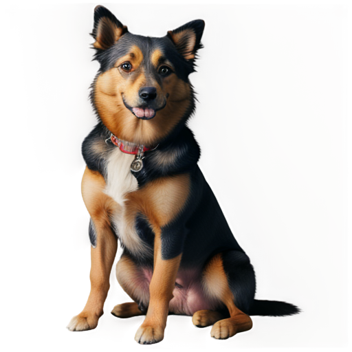

### Stable Diffusion XL

It's a LoRA and will compatible with any Diffusers usage: ControlNet, IPAdapter, etc.

```python
from huggingface_hub import hf_hub_download
from safetensors.torch import load_file
import torch

from diffusers import StableDiffusionXLPipeline

from models import TransparentVAEDecoder


transparent_vae = TransparentVAEDecoder.from_pretrained("madebyollin/sdxl-vae-fp16-fix", torch_dtype=torch.float16)
model_path = hf_hub_download(
    'LayerDiffusion/layerdiffusion-v1',
    'vae_transparent_decoder.safetensors',
)
transparent_vae.set_transparent_decoder(load_file(model_path))

pipeline = StableDiffusionXLPipeline.from_pretrained(
    "stabilityai/stable-diffusion-xl-base-1.0", 
    vae=transparent_vae,
    torch_dtype=torch.float16, variant="fp16", use_safetensors=True
).to("cuda")
pipeline.load_lora_weights('rootonchair/diffuser_layerdiffuse', weight_name='diffuser_layer_xl_transparent_attn.safetensors')

seed = torch.randint(high=1000000, size=(1,)).item()
prompt = "a cute corgi"
negative_prompt = ""
images = pipeline(prompt=prompt, 
                    negative_prompt=negative_prompt,
                    generator=torch.Generator(device='cuda').manual_seed(seed),
                    num_images_per_prompt=1, return_dict=False)[0]

images[0].save("result_sdxl.png")
```

## Scripts

All demo scripts expose CLI defaults for model, prompt, seed, output path, and
`--cpu-offload` where applicable. Run any script with `--help` to see its
overrides.

- `test_diffusers_fg_only.py`: Only generate transparent foreground image
- `test_diffusers_joint.py`: Generate foreground, background, blend image together. Hence `num_images_per_prompt` must be batch size of 3
- `test_diffusers_fg_bg_cond.py`: Generate foreground, conditioned on background provided. Hence `num_images_per_prompt` must be batch size of 2
- `test_diffusers_bg_fg_cond.py`: Generate background, conditioned on foreground provided. Hence `num_images_per_prompt` must be batch size of 2
- `test_diffusers_joint.py`: Generate foreground, background, blend image together. Hence `num_images_per_prompt` must be batch size of 3
- `test_diffusers_fg_only_sdxl.py`: Only generate transparent foreground image using Attention injection in SDXL
- `test_diffusers_fg_only_conv_sdxl.py`: Only generate transparent foreground image using Conv injection in SDXL
- `test_diffusers_fg_only_sdxl_img2img.py`: Generate transparent foreground image inpaint using Attention injection in SDXL
- `test_diffusers_xl_fg2ble.py`: Generate an SDXL blended image from a foreground condition using the converted `layer_xl_fg2ble.safetensors` delta
- `test_diffusers_xl_bg2ble.py`: Generate an SDXL blended image from a background condition using the converted `layer_xl_bg2ble.safetensors` delta
- `test_diffusers_xl_fgble2bg.py`: Generate an SDXL background from foreground and blend conditions using the converted `layer_xl_fgble2bg.safetensors` delta
- `test_diffusers_xl_bgble2fg.py`: Generate an SDXL transparent foreground from background and blend conditions using the converted `layer_xl_bgble2fg.safetensors` delta

It is said by the author that Attention injection would result in better generation quality and Conv injection would result in better prompt alignment

## Convert Scripts

The SDXL conditional examples download converted Diffusers weights from
`rootonchair/diffuser_layerdiffuse` by default. Use these scripts only when you
need to convert original Forge-format weights yourself.

Convert foreground-to-blending:

```bash
python scripts/convert_xl_layerdiffuse.py \
  --mode fg2ble \
  --input path/to/layer_xl_fg2ble.safetensors \
  --output weights/diffuser_layer_xl_fg2ble.safetensors
```

Convert background-to-blending:

```bash
python scripts/convert_xl_layerdiffuse.py \
  --mode bg2ble \
  --input path/to/layer_xl_bg2ble.safetensors \
  --output weights/diffuser_layer_xl_bg2ble.safetensors
```

Convert foreground-and-blend-to-background:

```bash
python scripts/convert_xl_layerdiffuse.py \
  --mode fgble2bg \
  --input path/to/layer_xl_fgble2bg.safetensors \
  --output weights/diffuser_layer_xl_fgble2bg.safetensors
```

Convert background-and-blend-to-foreground:

```bash
python scripts/convert_xl_layerdiffuse.py \
  --mode bgble2fg \
  --input path/to/layer_xl_bgble2fg.safetensors \
  --output weights/diffuser_layer_xl_bgble2fg.safetensors
```

## Example
### Stable Diffusion 1.5
#### Generate only transparent image with SD1.5
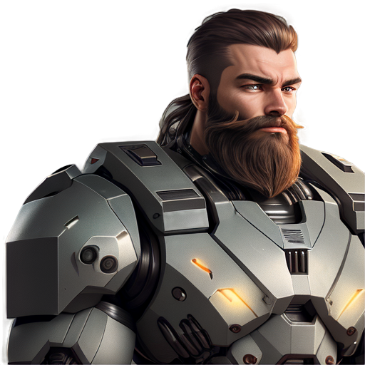
#### Generate foreground and background together

|              Foreground               |              Background               |                Blended                |
|:-------------------------------------:|:-------------------------------------:|:-------------------------------------:|
| 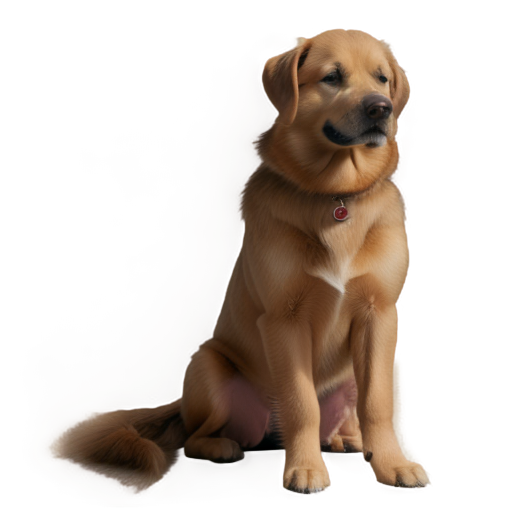      |   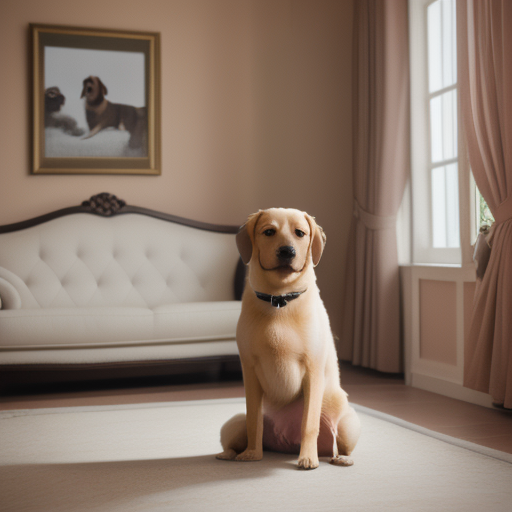    | 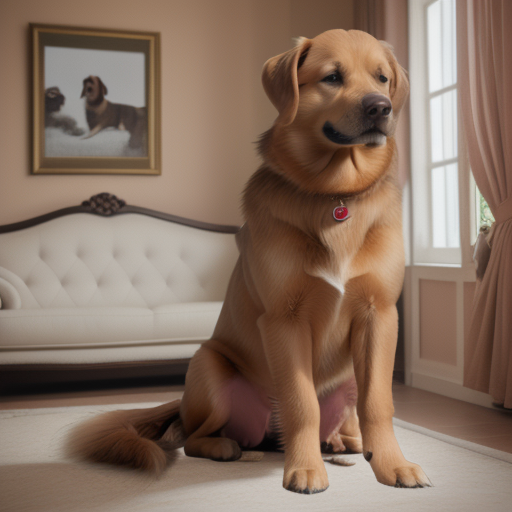   |


#### Use with ControlNet

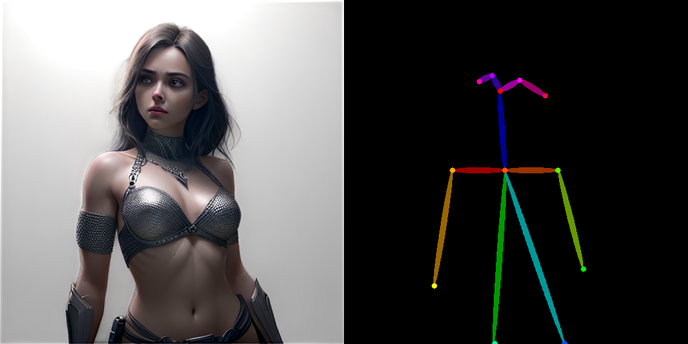

#### Use with IP-Adapter

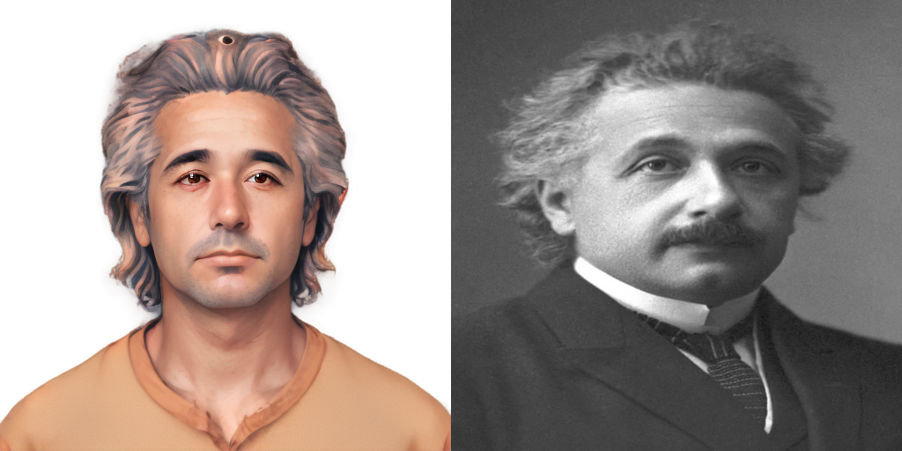

#### Generate foreground condition on background

The blended image will not have the correct color but you can apply foreground image on the condition background.

|              Foreground               |              Background (Condition)              |                Blended                |
|:-------------------------------------:|:-------------------------------------:|:-------------------------------------:|
| 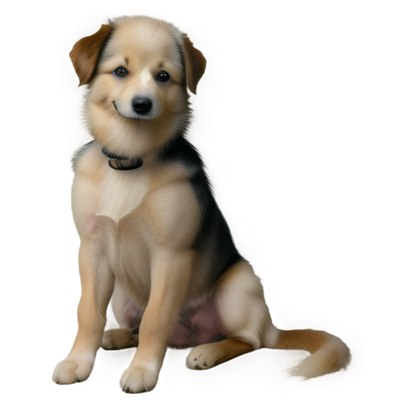      |   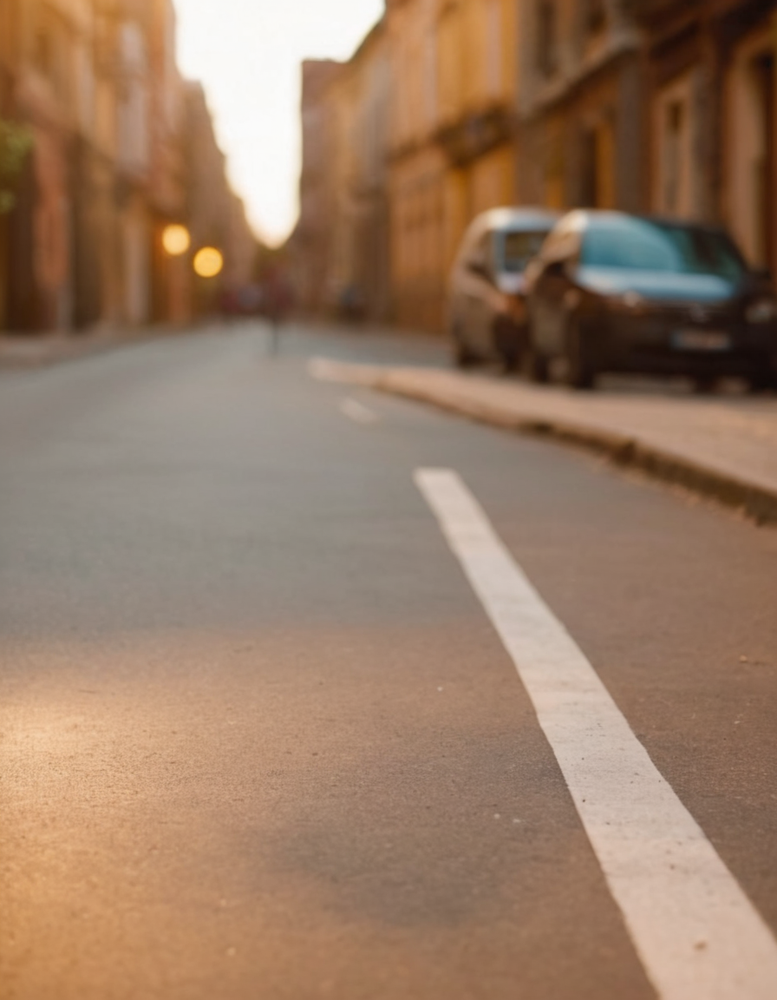    | 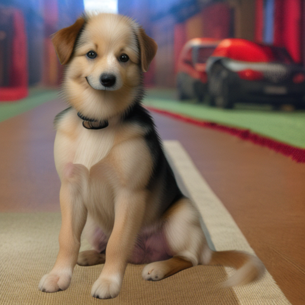   |


#### Generate background condition on foreground

|              Foreground (Condition)              |              Background               |                Blended                |
|:-------------------------------------:|:-------------------------------------:|:-------------------------------------:|
|       |   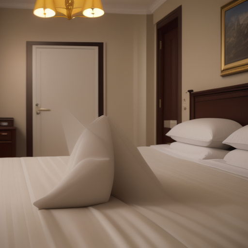    | 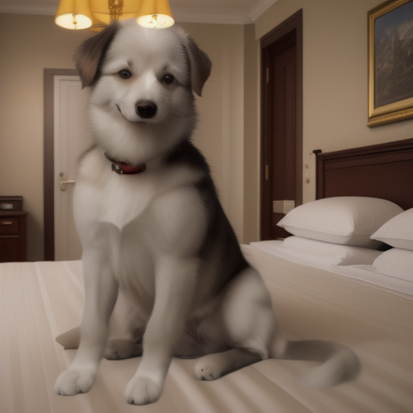   |

### Stable Diffusion XL

All SDXL conditional scripts share the same loading pattern: converted weights
are downloaded from `rootonchair/diffuser_layerdiffuse` into the Hugging Face
cache, `--variant none` can be used for models without Diffusers variants, and
`--cpu-offload` enables Accelerate CPU offload for lower VRAM usage.

The default SDXL base model uses `--variant fp16`. For checkpoints or Diffusers
repos without fp16 variant files, disable variant loading:

```bash
python test_diffusers_xl_bgble2fg.py \
  --model RunDiffusion/Juggernaut-XL-v6 \
  --variant none \
  --no-use-safetensors \
  --cpu-offload
```

#### Foreground condition

The fg2ble example downloads `diffuser_layer_xl_fg2ble.safetensors` from
`rootonchair/diffuser_layerdiffuse` into the Hugging Face cache and loads it
from there:

```bash
python test_diffusers_xl_fg2ble.py \
  --foreground assets/sdxl_fg_cond_detailed.png \
  --variant fp16 \
  --output result_xl_fg2ble.png
```

| SDXL foreground condition | Generated blended image |
|:-------------------------:|:-----------------------:|
| 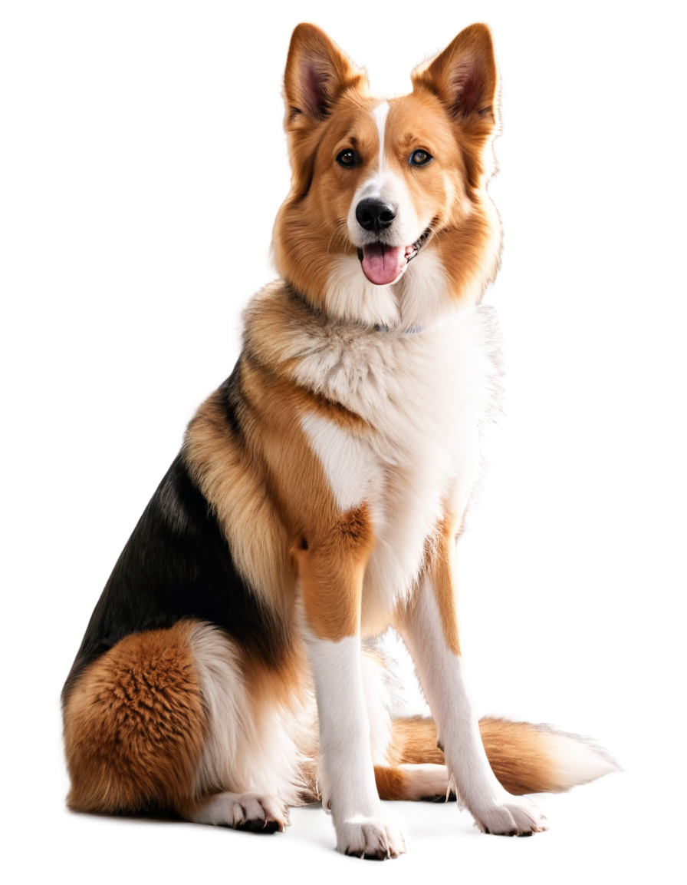 | 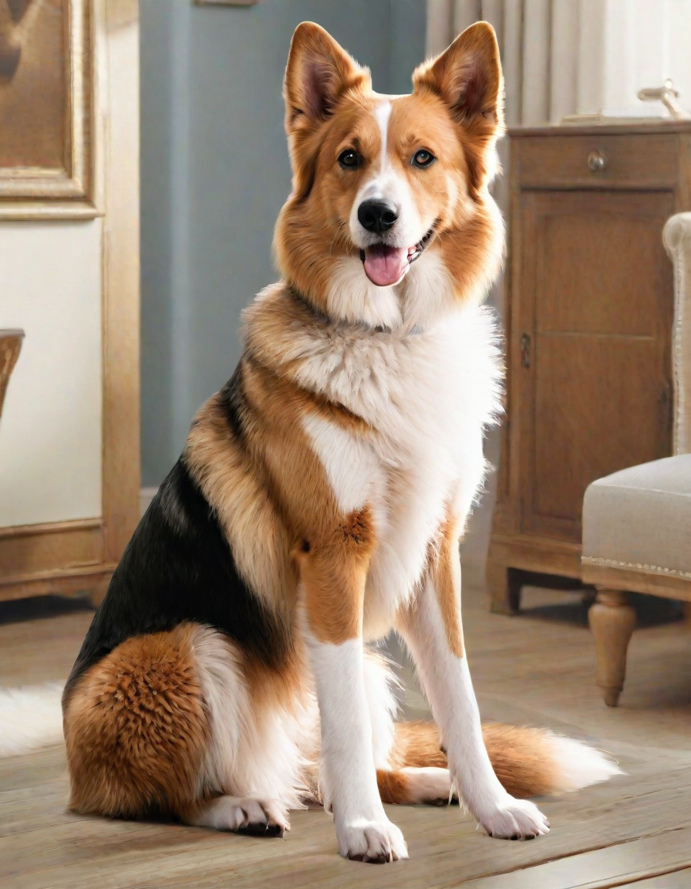 |

#### Background condition

The bg2ble example downloads `diffuser_layer_xl_bg2ble.safetensors` from
`rootonchair/diffuser_layerdiffuse` into the Hugging Face cache and loads it
from there. It forces DPM++ 2M SDE Karras to match the Forge sanity-check
workflow:

```bash
python test_diffusers_xl_bg2ble.py \
  --variant fp16 \
  --output result_xl_bg2ble.png
```

| SDXL background condition | Generated blended image |
|:-------------------------:|:-----------------------:|
| 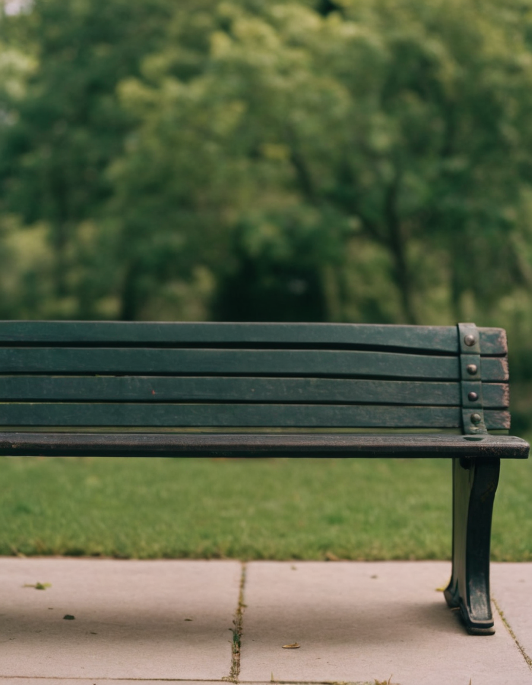 | 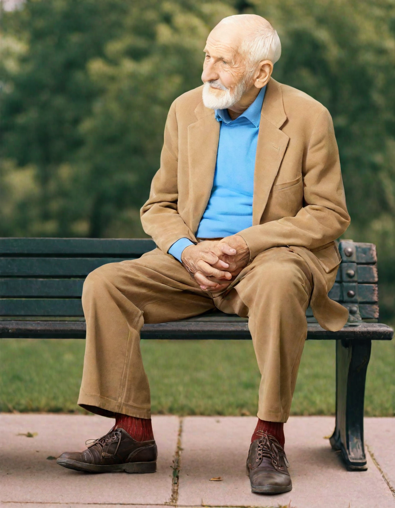 |

#### Foreground and blended conditions

The fgble2bg example downloads `diffuser_layer_xl_fgble2bg.safetensors` from
`rootonchair/diffuser_layerdiffuse` into the Hugging Face cache and loads it
from there:

```bash
python test_diffusers_xl_fgble2bg.py \
  --foreground assets/sdxl_fg_cond_detailed.png \
  --blend assets/sdxl_fg2ble_detailed_default_scheduler.png \
  --variant fp16 \
  --output result_xl_fgble2bg.png
```

The fgble2bg example forces DPM++ 2M SDE Karras via Diffusers'
`DPMSolverMultistepScheduler` and defaults to an 11-step fg+blend pass followed by
a 9-step base-UNet cleanup pass when `--steps 20` is used.

| Foreground condition | Blended condition | Generated background |
|:--------------------:|:-----------------:|:--------------------:|
|  |  | 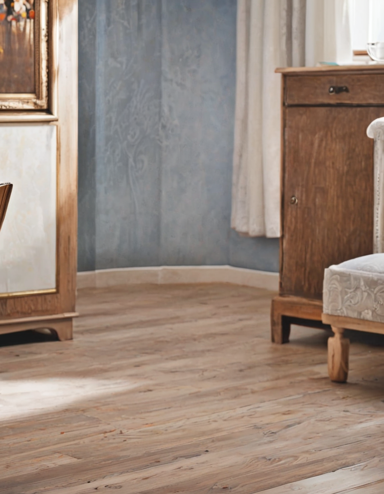 |

#### Background and blended conditions

The bgble2fg example downloads `diffuser_layer_xl_bgble2fg.safetensors` from
`rootonchair/diffuser_layerdiffuse` into the Hugging Face cache and uses the
transparent VAE decoder with the model's default scheduler to write an RGBA
foreground PNG:

```bash
python test_diffusers_xl_bgble2fg.py \
  --background assets/bg_cond_forge_sanity.png \
  --blend assets/sdxl_bg2ble_forge_sanity_dpm.png \
  --variant fp16 \
  --output result_xl_bgble2fg.png
```

| Background condition | Blended condition | Generated foreground |
|:--------------------:|:-----------------:|:--------------------:|
|  |  | 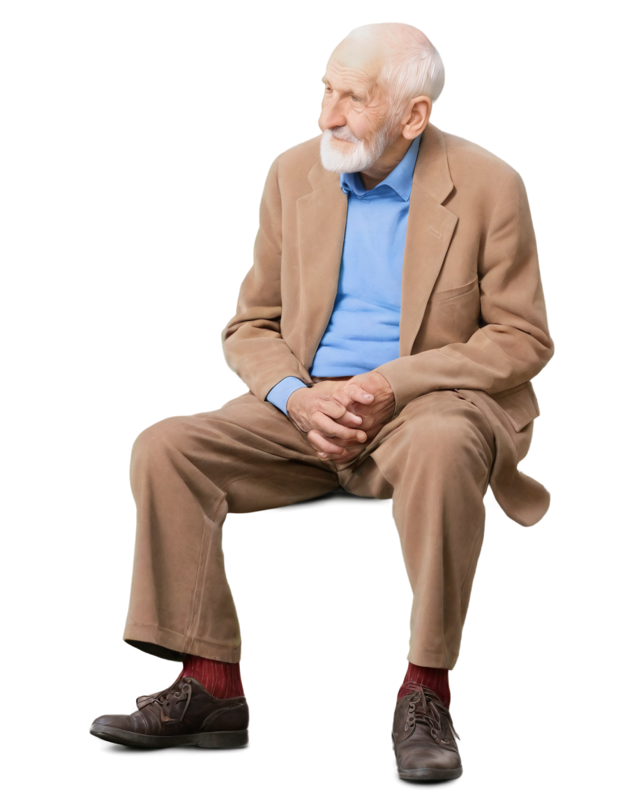 |

#### Combine with other LoRAs
Combine with SDXL Lora [nerijs/pixel-art-xl](https://huggingface.co/nerijs/pixel-art-xl)

|      Attn Injection (LoRA)                |        Conv Injection (Weight diff)            |
|:-------------------------------------:|:-------------------------------------:|
| 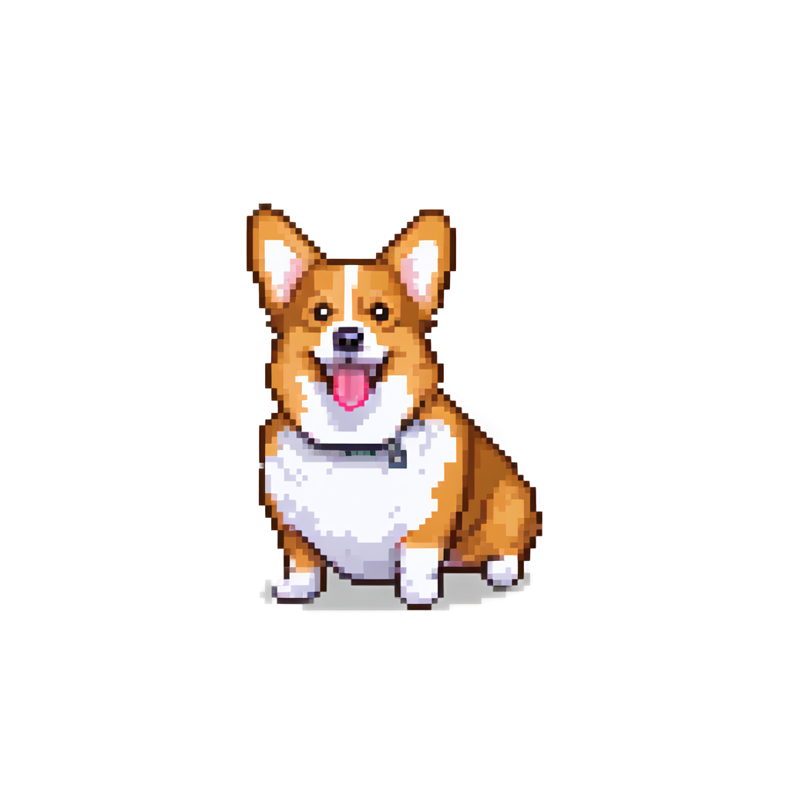      |   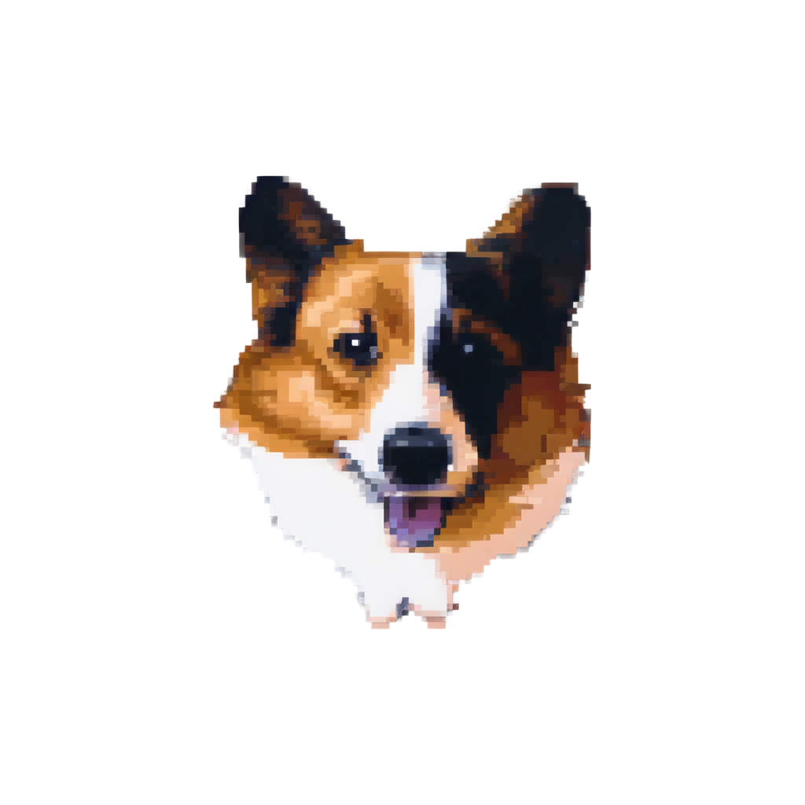    |

#### Inpaint
Use inpaint pipeline to refine poorly cropped transparent image

|              Foreground               |              Mask               |                Inpaint                |
|:-------------------------------------:|:-------------------------------------:|:-------------------------------------:|
| 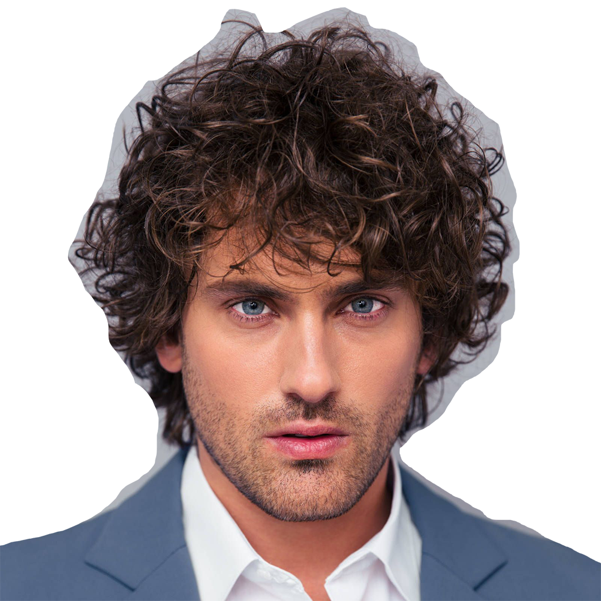      |   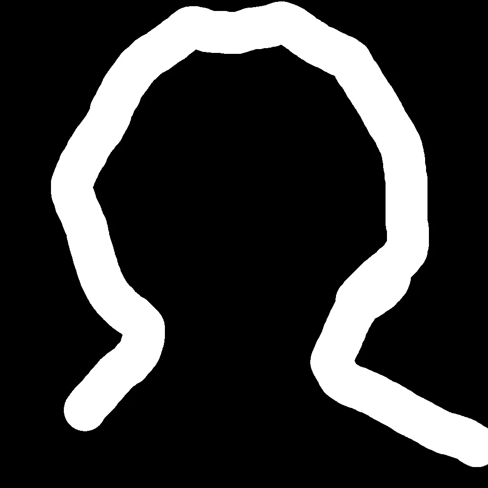    | 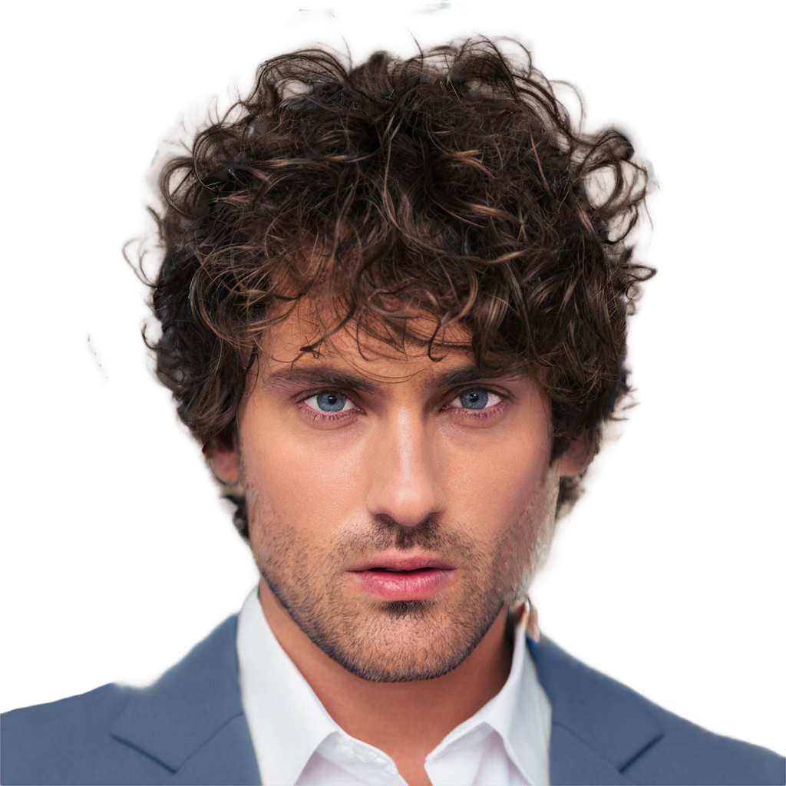   |

## Acknowledgments
This work is based on the great code at
[https://github.com/layerdiffusion/sd-forge-layerdiffuse](https://github.com/layerdiffusion/sd-forge-layerdiffuse)
